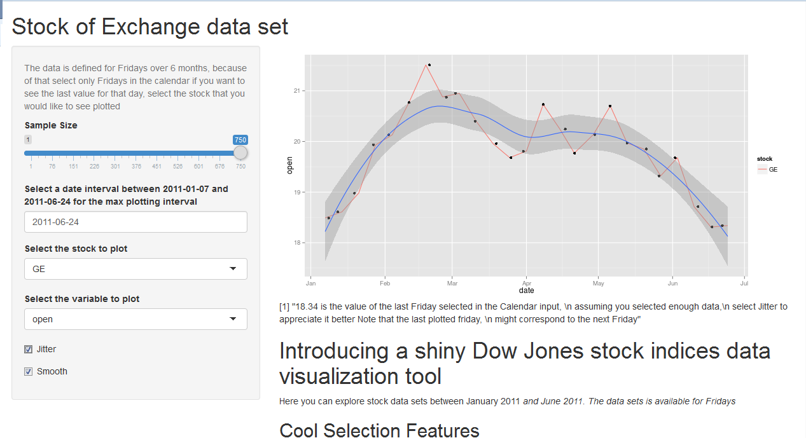

## Stock of Exchange data set
# Introducting a practical and useful visualization tool

<p>The following is a presentation of a the Shiny Stock of Exchange Visualization tool.</p>
 
<h1> Sometimes you would love to know how your investment is performing.</h1>
<h1> <p> </p> </h1>
<h1> But you have no time to look into the data set, and you just want to be able to visualize it online. </h1>
<h1> <p> </p> </h1>
<h1> <p> </p> </h1>
<h1> <p> </p> </h1>
<h1> You are in the right place! </h1>
<h1> <p> </p> </h1>

<h1> The source of the data is from </h1>

<p> 
The data set for the visualization tool was taken from </p>

<p>http://archive.ics.uci.edu/ml/datasets/Dow+Jones+Index/</p>

<p>
Brown, M. S., Pelosi, M. & Dirska, H. (2013). Dynamic-radius Species-conserving Genetic Algorithm for
the Financial Forecasting of Dow Jones Index Stocks. Machine Learning and Data Mining in Pattern
Recognition, 7988, 27-41. </p>

--- .class #id bg:#CBE7A5

## Here is an example of how the data looks like ##


```{r,echo=FALSE}
library(shiny)
library(ggplot2)
# Scripts\shinyproject\data
# C:\Users\Luis Miguel\Google Drive\Data Specialization JHU\DevelopingDataProducts\Scripts\shinyproject\data
setwd("C:/Users/Luis Miguel/Google Drive/Data Specialization JHU/DevelopingDataProducts/Scripts/shinyproject/data")
datanames <- read.csv("dow_jones_index.names")
data <- read.csv("dow_jones_index.data")
head(data,5)
#summary(data)
```

--- .class #id bg:#FFFF99

# This is what you can do with the Shiny App!

Some cools features of the tool, to analyze the previous data!

1. Visualize the data right away in a beautiful ggplot format!
2. Select from a pool of your avaible stocks.
3. I bet you are interested in a specific index, (opening price, or closing price!)
4. Select how much data you want to analyze
5. Select the plotting interval with a Date calendar input.
6. Include a smooth curve with its prediction interval
7. Select the variable to plot!

Visit the app at:

https://luism78.shinyapps.io/shinyproject/

--- .class #id 

# Here is a picture of how the app looks like in action!




