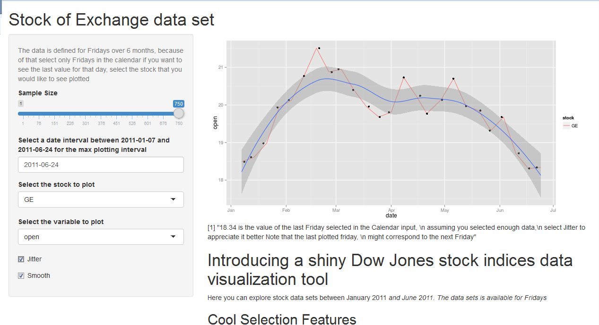

## Stock of Exchange data set
# Introducting a practical and useful visualization tool

<p>The following is a presentation of a the Shiny Stock of Exchange Visualization tool.</p>
 
<h1> Sometimes you would love to know how your investment is performing.</h1>
<h1> <p> </p> </h1>
<h1> But you have no time to look into the data set, and you just want to be able to visualize it online. </h1>
<h1> <p> </p> </h1>
<h1> <p> </p> </h1>
<h1> <p> </p> </h1>
<h1> You are in the right place! </h1>
<h1> <p> </p> </h1>

<h1> The source of the data is from </h1>

<p> 
The data set for the visualization tool was taken from </p>

<p>http://archive.ics.uci.edu/ml/datasets/Dow+Jones+Index/</p>

<p>
Brown, M. S., Pelosi, M. & Dirska, H. (2013). Dynamic-radius Species-conserving Genetic Algorithm for
the Financial Forecasting of Dow Jones Index Stocks. Machine Learning and Data Mining in Pattern
Recognition, 7988, 27-41. </p>

--- .class #id bg:#CBE7A5

## Here is an example of how the data looks like ##


```
##   quarter stock      date   open   high    low  close    volume
## 1       1    AA  1/7/2011 $15.82 $16.72 $15.78 $16.42 239655616
## 2       1    AA 1/14/2011 $16.71 $16.71 $15.64 $15.97 242963398
## 3       1    AA 1/21/2011 $16.19 $16.38 $15.60 $15.79 138428495
## 4       1    AA 1/28/2011 $15.87 $16.63 $15.82 $16.13 151379173
## 5       1    AA  2/4/2011 $16.18 $17.39 $16.18 $17.14 154387761
##   percent_change_price percent_change_volume_over_last_wk
## 1              3.79267                                 NA
## 2             -4.42849                           1.380223
## 3             -2.47066                         -43.024959
## 4              1.63831                           9.355500
## 5              5.93325                           1.987452
##   previous_weeks_volume next_weeks_open next_weeks_close
## 1                    NA          $16.71           $15.97
## 2             239655616          $16.19           $15.79
## 3             242963398          $15.87           $16.13
## 4             138428495          $16.18           $17.14
## 5             151379173          $17.33           $17.37
##   percent_change_next_weeks_price days_to_next_dividend
## 1                       -4.428490                    26
## 2                       -2.470660                    19
## 3                        1.638310                    12
## 4                        5.933250                     5
## 5                        0.230814                    97
##   percent_return_next_dividend
## 1                     0.182704
## 2                     0.187852
## 3                     0.189994
## 4                     0.185989
## 5                     0.175029
```

--- .class #id bg:#FFFF99

# This is what you can do with the Shiny App!

Some cools features of the tool, to analyze the previous data!

1. Visualize the data right away in a beautiful ggplot format!
2. Select from a pool of your avaible stocks.
3. I bet you are interested in a specific index, (opening price, or closing price!)
4. Select how much data you want to analyze
5. Select the plotting interval with a Date calendar input.
6. Include a smooth curve with its prediction interval
7. Select the variable to plot!

Visit the app at:

https://luism78.shinyapps.io/shinyproject/

--- .class #id 

# Here is a picture of how the app looks like in action!




